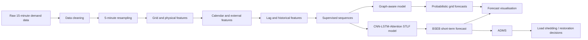

# Short-Term Load Forecasting and Automated Demand Management

A notebook-based short-term load forecasting project built around five-minute electricity-demand data. The notebook starts with raw regional demand data, converts the original 15-minute observations into a five-minute time series, adds grid, calendar, weather, renewable, market, behavioral and lag-based features, and then experiments with graph-aware and deep-learning forecasting models.

The project is designed around a practical power-system workflow rather than treating forecasting as an isolated regression problem. The final part of the notebook connects the forecast to an Automated Demand Management System (ADMS), where a small optimization model decides which flexible loads should be shed when forecast generation is insufficient.

> This README describes the notebook as it currently exists. Some of the feature signals in the notebook, including renewable generation, market, economic and behavioral variables, are synthetic demonstration features and should be replaced with real operational data before being used for production forecasting.

---

## Contents

- [Project Overview](#project-overview)
- [What the Notebook Does](#what-the-notebook-does)
- [Notebook Workflow](#notebook-workflow)
- [Dataset](#dataset)
- [Data Preparation](#data-preparation)
- [Feature Engineering](#feature-engineering)
- [Grid Representation](#grid-representation)
- [Graph Convolution](#graph-convolution)
- [Forecasting Models](#forecasting-models)
- [Probabilistic Forecasting](#probabilistic-forecasting)
- [Training and Evaluation](#training-and-evaluation)
- [Visual Diagnostics](#visual-diagnostics)
- [Automated Demand Management System](#automated-demand-management-system)
- [Project Outputs](#project-outputs)
- [How to Run the Notebook](#how-to-run-the-notebook)
- [Reproducibility Notes](#reproducibility-notes)
- [Important Implementation Notes](#important-implementation-notes)
- [Current Results](#current-results)
- [Limitations and Next Steps](#limitations-and-next-steps)
- [Project Structure](#project-structure)

---

## Project Overview

Short-term load forecasting is the problem of estimating electricity demand a few minutes or hours into the future. At this time scale, the forecast needs to react to recent demand changes while still capturing recurring daily, weekly and seasonal patterns.

This notebook explores that problem using a hybrid approach with three main ideas:

1. **Temporal learning**  
   CNN and LSTM layers are used to learn local changes and longer temporal dependencies.

2. **Attention-based forecasting**  
   Multi-head attention is used to allow the model to place different importance on historical time steps.

3. **Grid-aware learning**  
   A custom graph convolution layer represents relationships between four regional grid nodes:
   DVC, BSEB, WBSEB and SIKKIM.

The notebook then extends the forecast into a simple operational decision layer through an ADMS formulation using linear optimization.

---

## What the Notebook Does

The complete notebook can be viewed as the following pipeline:



The notebook is not a single model implementation. It contains several stages and experiments that build toward a broader short-term forecasting and demand-management workflow.

---

## Notebook Workflow

The notebook is organized approximately as follows.

| Stage | Purpose |
|---|---|
| Environment setup | Install the Python packages used by the notebook |
| Data acquisition | Download and mount the source dataset |
| Data inspection | Identify the actual file format and inspect the available columns |
| Data cleaning | Parse timestamps, remove invalid records and duplicates |
| Resampling | Convert 15-minute demand observations to five-minute intervals |
| Grid features | Build power-flow and grid-stress indicators |
| Renewable/market features | Add renewable, market and risk-related signals |
| Graph construction | Define the four-node grid topology |
| Graph convolution | Learn information propagated through connected nodes |
| Graph forecasting | Train a grid-aware probabilistic forecasting model |
| Feature engineering | Build a broader feature matrix for STLF |
| CNN-LSTM-Attention model | Forecast BSEB demand |
| Evaluation | Calculate forecasting metrics and compare with a naive baseline |
| ADMS | Use forecast demand and generation to make load-control decisions |

---

# Dataset

The source data contains electricity demand information at 15-minute resolution for 2022.

The notebook identifies the following major columns:

### Scheduled demand

- `BSEB Sch`
- `JSEB Sch`
- `DVC Sch`
- `GRIDCO Sch`
- `WBSEB Sch`
- `SIKKIM Sch`

### Actual demand

- `BSEB Act`
- `JSEB Act`
- `DVC Act`
- `GRIDCO Act`
- `WBSEB Act`
- `SIKKIM Act`

The source data covers:

```text
2022-01-01 00:00
to
2022-12-31 23:45
```

The notebook reports 35,040 original 15-minute observations.

The forecasting target used by the main STLF experiment is:

```text
BSEB Act
```

---

# Data Preparation

## 1. Timestamp processing

The original `Time` column is converted to a proper datetime representation using day-first parsing.

Invalid timestamps are removed, duplicate timestamps are removed, and the resulting records are sorted chronologically.

The cleaned timestamp is renamed to:

```text
datetime
```

and used as the time-series index.

---

## 2. Demand column selection

Actual-demand columns are identified using the `Act` naming convention.

The selected regional demand series are then converted to numeric values.

---

## 3. Outlier treatment

For each selected demand series, the notebook calculates the first and ninety-ninth percentiles and clips values outside that range.

Missing values are then filled using interpolation followed by backward filling.

This step is intended to prevent isolated extreme values and missing observations from disrupting the subsequent resampling and sequence-building stages.

---

## 4. Five-minute resampling

The original dataset is recorded every 15 minutes.

The notebook creates a continuous five-minute index:

```text
00:00
00:05
00:10
00:15
...
```

Missing five-minute observations are filled using time interpolation.

The resulting dataset contains:

```text
105,118 rows
```

and covers the full year at five-minute resolution.

The notebook saves this intermediate dataset as:

```text
data/demand_5min.csv
```

---

# Feature Engineering

The notebook builds several groups of features rather than relying only on the raw BSEB demand series.

## Grid and power-flow features

The following features are created from the regional actual-demand values:

### Total_Draw

The combined demand of:

```text
BSEB + WBSEB + SIKKIM
```

### Grid_Balance

Calculated as:

```text
DVC - Total_Draw
```

### DVC_Utilization

Calculated as:

```text
Total_Draw / DVC
```

with a small numerical stabilizer in the denominator.

### Grid_Stress

A binary indicator activated when:

```text
DVC_Utilization > 0.9
```

These features are intended to give the forecasting model some representation of grid operating conditions instead of treating demand as an independent scalar time series.

---

## Renewable features

The notebook creates:

- `Solar_MW`
- `Wind_MW`
- `Renewable_Total`
- `RE_Penetration`

The solar and wind series are generated synthetically inside the notebook. They are therefore useful for demonstrating the feature pipeline, but they should not be interpreted as measured renewable generation.

The notebook also calculates:

```text
Net_Demand = Total_Draw - Renewable_Total
```

---

## Market and risk features

The notebook creates:

- `Market_Price`
- `Ramp_Rate`
- `Volatility`
- `Forecast_Risk`

`Market_Price` is generated from net demand plus synthetic noise.

`Ramp_Rate` measures the change in net demand between consecutive five-minute observations.

`Volatility` is calculated from a rolling standard deviation of the ramp rate.

`Forecast_Risk` combines several conditions, including grid stress, renewable penetration and high volatility.

---

## Calendar features

The feature-engineering stage includes:

- hour
- day of week
- month
- day of year
- quarter
- weekend indicator
- office-hours indicator
- morning-peak indicator
- evening-peak indicator

---

## Indian holiday and festival features

The notebook uses the `holidays` package to generate Indian holiday indicators.

It also explicitly creates:

```text
is_holiday
diwali_effect
holi_effect
```

These features are intended to capture behavioral demand changes associated with holidays and major festivals.

---

## Behavioral and contextual features

Additional signals include:

```text
economic_index
social_media_trend
traffic_index
ev_charging_pattern
```

These are synthetic or proxy-style variables in the current notebook.

They demonstrate how external behavioral information could be incorporated into a forecasting model, but they should be replaced with real data before drawing operational conclusions from them.

---

## Lag features

Historical demand values are added for each demand column using:

```text
lag1
lag12
lag288
```

With five-minute data, these correspond approximately to:

| Feature | Meaning |
|---|---|
| `lag1` | Previous five-minute observation |
| `lag12` | Previous hour |
| `lag288` | Previous 24 hours |

The lag features are filled after creation so that the final feature matrix does not contain missing values.

The notebook reports the resulting feature matrix as:

```text
105,118 rows × 78 features
```

---

# Grid Representation

The graph portion of the notebook represents four regional grid nodes:

```text
0 -> DVC
1 -> BSEB
2 -> WBSEB
3 -> SIKKIM
```

The base adjacency matrix is:

```text
[[1, 1, 1, 1],
 [1, 1, 0, 0],
 [1, 0, 1, 0],
 [1, 0, 0, 1]]
```

This represents DVC as the central node connected to the other three nodes.

Self-loops are included.

The adjacency matrix is normalized using:

```text
A_norm = D^(-1/2) A D^(-1/2)
```

which produces:

```text
[[0.25     , 0.353553, 0.353553, 0.353553],
 [0.353553, 0.5     , 0.      , 0.      ],
 [0.353553, 0.      , 0.5     , 0.      ],
 [0.353553, 0.      , 0.      , 0.5     ]]
```

---

# Graph Convolution

The notebook defines a custom `GraphConv` layer.

The layer receives graph sequences with the shape:

```text
(batch, time, nodes, features)
```

For this project:

```text
nodes = 4
features = 1
sequence length = 12
```

The graph convolution performs the operation:

```text
A_norm X W
```

where:

- `A_norm` is the normalized grid adjacency matrix
- `X` is the input graph sequence
- `W` is a trainable transformation matrix

The graph layer therefore allows information from connected regional nodes to be incorporated into the representation of each node.

---

# Graph Sequence Preparation

The graph input uses a one-hour historical window:

```text
12 × 5 minutes = 60 minutes
```

The resulting graph sequence shape is:

```text
(105106, 12, 4, 1)
```

This means:

```text
105,106 samples
12 historical time steps
4 grid nodes
1 feature per node
```

---

# Graph-Aware Forecasting Model

The first forecasting experiment uses:

```text
Graph Convolution
        ↓
Reshape
        ↓
LSTM
        ↓
Multi-Head Attention
        ↓
Dense layer
        ↓
Probabilistic output
```

The graph convolution produces:

```text
(batch, 12, 4, 16)
```

The node and graph-feature dimensions are then flattened into a temporal representation of:

```text
(batch, 12, 64)
```

The LSTM models temporal dependencies across the historical sequence.

Multi-head attention then provides a mechanism for focusing on different parts of the sequence.

---

# Probabilistic Forecasting

The graph model produces eight outputs:

```text
μ_DVC
μ_BSEB
μ_WBSEB
μ_SIKKIM

logσ²_DVC
logσ²_BSEB
logσ²_WBSEB
logσ²_SIKKIM
```

The first four values represent predicted demand means.

The remaining four represent predicted log variances.

The notebook uses Gaussian Negative Log-Likelihood:

```text
NLL = 0.5 * (
    log_variance
    +
    (y - μ)² / variance
)
```

with:

```text
variance = exp(log_variance)
```

This allows the model to produce both a point forecast and an uncertainty estimate.

---

# Graph Model Results

The notebook's graph forecasting experiment reports the following mean absolute errors:

| Grid | MAE | Approx. sigma |
|---|---:|---:|
| DVC | 243.59 MW | 206.47 MW |
| BSEB | 558.15 MW | 690.76 MW |
| WBSEB | 258.69 MW | 375.26 MW |
| SIKKIM | 20.17 MW | 26.87 MW |

These results belong to the graph-model experiment in the notebook and should be interpreted separately from the later BSEB STLF experiment.

---

# CNN-LSTM-Attention STLF Model

The second major forecasting experiment is a dedicated short-term load forecasting model.

Its structure is:

```text
                 ┌── CNN branch ──────────┐
Input sequence ──┤                         ├── Fusion
                 └── LSTM + Attention ────┘
                                            │
                                            ├── Base forecast
                                            ├── Peak forecast
                                            └── Seasonal forecast
                                                    │
                                              Ensemble layer
                                                    │
                                             Final forecast
```

---

## CNN branch

Two one-dimensional convolution layers are used:

```text
Conv1D: 64 filters, kernel size 3
Conv1D: 32 filters, kernel size 3
```

Batch normalization follows both convolution layers.

The CNN branch is intended to capture local short-term patterns in the historical sequence.

---

## Main LSTM branch

The temporal branch contains:

```text
LSTM(64)
LSTM(32)
```

with sequence outputs retained.

Dropout is applied within the LSTM layers.

This branch is responsible for learning temporal dependencies that may extend beyond individual local changes.

---

## Attention layer

The main temporal representation is passed through:

```text
MultiHeadAttention
4 heads
key dimension = 32
```

followed by layer normalization.

The purpose is to allow the model to assign different importance to historical time steps.

---

# Forecast Ensemble

The notebook also contains three separate forecasting branches.

### Base branch

Designed to learn the general demand level.

### Peak branch

Uses a smaller convolution and LSTM path intended to capture short-term peak behavior.

### Seasonal branch

Uses an LSTM and attention path intended to capture broader recurring patterns.

The three branch outputs are concatenated and passed through a trainable weighted combination.

The final layer produces the short-term demand forecast.

---

# Training Configuration

The STLF training pipeline uses:

```text
Sequence length : 12
Interval        : 5 minutes
History         : 60 minutes
Forecast target : next five-minute BSEB demand
Train/test split: chronological 80/20
Batch size      : 64
Maximum epochs  : 100
Optimizer       : Adam
Loss            : Mean Squared Error
```

Early stopping monitors validation loss and restores the best model weights.

`ReduceLROnPlateau` is also used to reduce the learning rate when validation performance stops improving.

---

# Scaling

Input and target values are scaled separately using `MinMaxScaler`.

The scalers are fitted using training data only:

```text
Training data
     ↓
Fit scaler
     ↓
Transform training data
     ↓
Transform test data
```

This prevents the test set from influencing the fitted scaling parameters.

The predictions are converted back into MW before calculating the final forecasting metrics.

---

# Evaluation Metrics

The notebook calculates:

### MAE

Mean Absolute Error measures the average absolute forecasting error in MW.

```text
MAE = mean(|actual - prediction|)
```

### MSE

Mean Squared Error penalizes larger errors more strongly.

### RMSE

Root Mean Squared Error returns the error in the original MW scale.

### MAPE

Mean Absolute Percentage Error reports the average percentage error.

### Median Absolute Error

This provides a more robust view of the typical error when large outliers exist.

### R²

R² measures the proportion of variance explained by the forecasting model.

---

# Baseline

The notebook also calculates a naive previous-value forecast.

The idea is straightforward:

```text
next demand ≈ previous demand
```

For a five-minute forecasting problem, this is an important baseline because electricity demand is often highly autocorrelated over short intervals.

The baseline should be retained when evaluating future model revisions. A more complex model should ideally provide measurable improvement over this simple reference.

---

# Visual Diagnostics

The notebook generates several visual diagnostics.

## Data resolution comparison

The original 15-minute demand series is plotted against the resampled five-minute series.

This makes the interpolation step visible rather than treating resampling as an invisible preprocessing operation.

---

## Training and validation loss

The training curve shows whether the model is learning and whether validation performance begins to diverge from training performance.

---

## First-day forecast

The first 288 five-minute observations correspond to approximately 24 hours.

The notebook compares:

```text
Actual demand
Predicted demand
```

over this period.

---

## Error distribution

A histogram is used to inspect the distribution of:

```text
actual - predicted
```

This helps identify whether errors are centered around zero or systematically biased.

---

## Actual vs predicted scatter plot

The scatter plot compares predicted demand against actual demand.

The ideal relationship is represented by the diagonal:

```text
prediction = actual
```

---

## Residual plot

Residuals are plotted across the complete test set to identify systematic changes in error over time.

---

# Automated Demand Management System

The final section connects forecasting with operational decision making.

The ADMS receives:

```text
Forecast demand
Forecast generation
```

and calculates:

```text
imbalance = demand - generation
```

A positive imbalance indicates that forecast demand is higher than forecast generation.

---

## Flexible loads

The notebook defines three controllable loads:

| Load | Power | Priority |
|---|---:|---:|
| EV charger | 5 MW | 3 |
| AC unit | 3 MW | 2 |
| Industrial pump | 7 MW | 1 |

The priority values act as the cost of shedding each load.

---

## Load-shedding optimization

When:

```text
demand - generation > 2 MW
```

the ADMS creates a binary optimization problem.

For each available load:

```text
x = 1 → shed the load
x = 0 → keep the load active
```

The objective is to minimize total priority cost while ensuring that the selected loads provide enough power reduction to cover the forecast imbalance.

Conceptually:

```text
Minimize:
    total shedding priority

Subject to:
    total shed power >= forecast shortage
```

This is solved using PuLP.

---

## Restoration logic

When forecast generation becomes greater than demand by more than the configured buffer, inactive loads can be restored if their cooldown period has expired.

The notebook uses:

```text
Buffer   : 2 MW
Cooldown : 3 intervals
```

Since each interval represents five minutes, the cooldown corresponds to approximately fifteen minutes.

---

# ADMS Output

The notebook records:

```text
time
demand
generation
imbalance
action
```

in:

```text
logs/adms_log.csv
```

The recorded demonstration run reports:

```text
Load shed events     : 3
Load restore events  : 0
```

The notebook also visualizes forecast demand, forecast generation and the intervals in which load shedding was triggered.

---

# Project Outputs

The notebook writes project artifacts into the Google Drive project directory.

The main paths used by the notebook are:

```text
STLF_project/
├── data/
│   ├── demand_5min.csv
│   └── features_5min.csv
│
├── models/
│   ├── gcn_spatial_model.keras
│   ├── stlf_model.h5
│   ├── scaler_X.pkl
│   └── scaler_y.pkl
│
├── plots/
│   └── stlf_results.png
│
└── logs/
    └── adms_log.csv
```

The exact set of files depends on which cells have been executed.

---

# How to Run the Notebook

The notebook is written for Google Colab.

## 1. Open the notebook

Upload the `.ipynb` file to Google Colab or open it from Google Drive.

## 2. Enable GPU

The notebook is configured for a Colab GPU runtime and identifies a T4 GPU in its saved notebook metadata.

In Colab:

```text
Runtime
→ Change runtime type
→ Hardware accelerator
→ GPU
```

A GPU is recommended for the deep-learning training sections.

## 3. Run the installation cell

The first cell installs the required Python packages:

```text
tensorflow
scikit-learn
pandas
numpy
matplotlib
seaborn
holidays
requests
shap
joblib
pulp
gdown
```

## 4. Mount Google Drive

The notebook mounts:

```text
/content/drive
```

and uses:

```text
/content/drive/MyDrive/STLF_project
```

as the project workspace.

## 5. Download the source data

The notebook downloads the shared source file using `gdown`.

One detail is worth noting: although the downloaded file is initially named `Demand_15min.csv`, the notebook detects that it is actually an Excel 2007+ file and then loads it using `pandas.read_excel`.

The cleaned data is subsequently written back to CSV for the rest of the workflow.

## 6. Execute the notebook in order

The cells are stateful. Run them from top to bottom rather than jumping directly to the model-training cells.

The main dependency chain is:

```text
Dataset
  ↓
Clean data
  ↓
demand_5min
  ↓
Grid features
  ↓
Feature engineering
  ↓
Sequences
  ↓
Models
  ↓
Evaluation
  ↓
ADMS
```

---

# Reproducibility Notes

Several parts of the notebook explicitly use:

```python
np.random.seed(42)
```

This is important because the current notebook generates synthetic solar, wind, economic and other proxy signals.

The same seed is also used when creating parts of the synthetic feature set.

However, exact neural-network training results can still vary depending on:

- TensorFlow version
- CUDA/cuDNN configuration
- GPU hardware
- execution environment
- library versions
- nondeterministic GPU operations

For research-grade reproducibility, the environment versions should therefore be recorded alongside the notebook.

---

# Important Implementation Notes

## Synthetic external features

The notebook currently creates several external signals synthetically.

Examples include:

```text
Solar_MW
Wind_MW
Market_Price
economic_index
social_media_trend
traffic_index
ev_charging_pattern
```

These are useful for demonstrating the intended feature architecture, but they are not equivalent to measured operational data.

For a production system, they should be replaced with actual:

- solar generation
- wind generation
- market-price
- weather
- traffic
- EV charging
- economic or demand-response data

sources.

---

## Graph topology

The graph is intentionally small and uses four regional nodes:

```text
DVC
BSEB
WBSEB
SIKKIM
```

DVC is represented as the central connection point.

The graph is therefore a simplified representation of the regional relationship rather than a full electrical network model.

A production implementation could use a topology derived from actual transmission connectivity, line capacities, impedances or other network information.

---

## Five-minute interpolation

The original source is 15-minute data.

The five-minute dataset is created through time interpolation.

Therefore, the additional five-minute observations are estimated values rather than independently measured five-minute observations.

This matters when interpreting very short-horizon forecasting performance.

---

## Forecasting target

The main STLF experiment predicts:

```text
BSEB Act
```

one five-minute step ahead.

The graph experiment instead works with the four regional grid nodes.

These are related experiments, but they should not be treated as identical prediction tasks.

---

# Current Results

The notebook contains more than one forecasting experiment, so the results should be kept separate.

## Graph forecasting experiment

The recorded graph-model MAE values are:

```text
DVC     243.59 MW
BSEB    558.15 MW
WBSEB   258.69 MW
SIKKIM   20.17 MW
```

The graph model also produces an uncertainty estimate through the predicted log-variance outputs.

---

## CNN-LSTM-Attention STLF experiment

The recorded notebook run reports:

```text
MAE       1181.7663 MW
MSE       1648364.6791 MW²
RMSE      1283.8866 MW
MAPE      43.6423%
Median AE 1234.3779 MW
R²        -4.1141
```

The same run reports a naive previous-value RMSE of:

```text
24.1138 MW
```

This result is important when interpreting the notebook. The current STLF experiment is an exploratory implementation and does not demonstrate superiority over the naive baseline.

The model architecture and pipeline are useful as a research starting point, but the forecasting performance needs further work before the model should be presented as an improvement over persistence.

---

# Limitations and Next Steps

The notebook is deliberately broader than a single forecasting model, but several areas should be improved before moving toward a production or publication-grade system.

### 1. Replace synthetic external variables

Use real renewable, weather, market and behavioral measurements.

### 2. Improve the forecasting target design

The current five-minute series is created from 15-minute observations through interpolation. Access to true five-minute measurements would provide a stronger experimental foundation.

### 3. Establish strict baseline comparisons

At minimum, compare against:

```text
Persistence
Seasonal persistence
Linear/regularized regression
Tree-based model
CNN/LSTM baseline
Proposed hybrid model
```

### 4. Improve model calibration

Probabilistic forecasts should be evaluated not only by whether their intervals contain the actual value, but also by whether those intervals are sharp and well calibrated.

Useful future metrics include:

```text
Pinball loss
CRPS
Prediction interval width
Coverage by nominal confidence level
Calibration curves
```

### 5. Use real network information

The graph should eventually represent actual transmission relationships rather than a simplified four-node topology.

### 6. Separate research experiments

The notebook currently contains multiple model experiments. A cleaner final research pipeline would make the data split, target definition, features, model, baseline and evaluation protocol identical across all compared methods.

### 7. Validate ADMS decisions with realistic operational constraints

The current ADMS is a demonstration optimizer. A real deployment would need constraints such as:

- minimum on/off durations
- load-specific availability
- customer priorities
- ramp limits
- reserve requirements
- generation constraints
- transmission constraints
- restoration policies
- safety limits

---

# Project Structure

A clean repository version of the work can be organized as:

```text
STLF_project/
│
├── notebook/
│   └── stlf_project.ipynb
│
├── data/
│   ├── raw/
│   │   └── Demand_15min
│   ├── demand_5min.csv
│   └── features_5min.csv
│
├── models/
│   ├── gcn_spatial_model.keras
│   ├── stlf_model.h5
│   ├── scaler_X.pkl
│   └── scaler_y.pkl
│
├── plots/
│   └── stlf_results.png
│
├── logs/
│   └── adms_log.csv
│
└── README.md
```

The repository structure above is a recommended organization of the notebook artifacts; the notebook itself currently creates the corresponding `data`, `models`, `plots` and `logs` directories under `STLF_project`.

---

# Technologies Used

| Area | Technology |
|---|---|
| Language | Python |
| Notebook environment | Google Colab |
| Numerical computing | NumPy |
| Data processing | Pandas |
| Machine learning | Scikit-learn |
| Deep learning | TensorFlow / Keras |
| Graph learning | Custom Keras GraphConv layer |
| Visualization | Matplotlib, Seaborn |
| Calendar features | Holidays |
| Explainability dependency | SHAP |
| Serialization | Joblib |
| Optimization | PuLP |
| Dataset download | gdown |

---

# Final Perspective

The main idea behind the project is to move from a conventional load-forecasting pipeline toward a system that understands three things at the same time:

```text
What happened recently?
        +
What is happening across connected grid regions?
        +
What operating action should follow from the forecast?
```

The forecasting side combines temporal deep learning, attention and graph information. The final ADMS stage then turns a forecast into an operational decision through constrained optimization.

The current notebook should be viewed as a research prototype and experimental foundation. Its strongest value is the complete workflow: data preparation, feature construction, graph representation, temporal modelling, probabilistic forecasting, evaluation, visualization and forecast-driven demand management are all demonstrated in one place.

Before using the system for operational decisions, the synthetic inputs, forecasting calibration, baseline comparisons and network constraints should be replaced or strengthened with real system data and a stricter experimental protocol.
